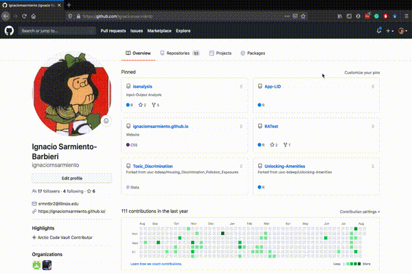
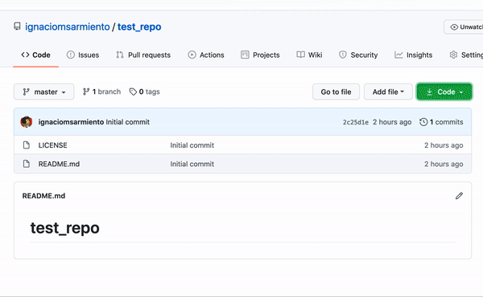
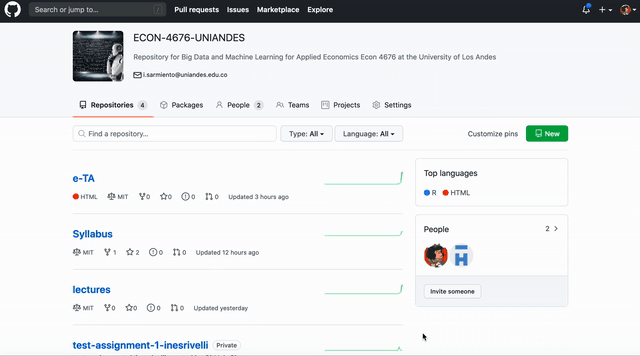

Hello! Welcome to e-TAs, your on-line help for ECON 4676. So you want to learn how to use Github. In this e-TA, you will learn the intricacies and specifics of working with Github and strategies to keep your file version control under your control. The present issue focuses on the basic operations of `Git` and `Github`. The core material was extracted from tutorials at the [BDEEP group](https://www.uiuc-bdeep.org/about) at [NCSA](http://www.ncsa.illinois.edu/site) and [Prof. Grant McDermott](https://grantmcdermott.com/) [^fn-1] 


[^fn-1]: If you have comments, suggestions, etc. please submit a pull request ;).

# Motivation

<div align="center">

</div>

## Git(Hub) solves this problem

### Git

- Git is a distributed version control system. (Wait, what?)
- Okay, try this: Imagine if Dropbox and the "Track changes" feature in MS Word had a baby. Git would be that baby.
- In fact, it's even better than that because Git is optimized for the things that economists and data scientists spend a lot of time working on (e.g. code).
- There is a learning curve, but I promise you it's worth it.

### GitHub

- It's important to realize that Git and GitHub are distinct things.
- GitHub is an online hosting platform that provides an array of services built on top of the Git system. (Similar platforms include Bitbucket and GitLab.)
- Just like we don't *need* Rstudio to run R code, we don't *need* GitHub to use Git... But it will make our lives so much easier.


# Repositories

When you begin a new coding project, you will want to create a new repository. This repository will grow to hold all of the important files for your project. 


### Create a repository
You can create a new repository by clicking the green "new repository" button on your github homepage.



- Step 1: Name your repository
Give your repository an accurate and concise name. You want the project to be recognizable! You can also add an optional description to summarize the goal of your project. 

-  Step 2: Public or private
Most repositories should be made public unless you have a specific reason to make it private. A public repository can be viewed by anyone but you can choose who can commit to it. Since it can be seen by others, it is possible to collaborate with others if you need help. A private repository can only be viewed by you and you are the only person who can commit to it, but you are able to manually add other collaborators as well. Private reposoitories are only available for paid accounts.

- Step 3: Add a README
Finally, select "initialize with a README". You should only keep this unchecked if you are creating a repository from an existing repository. 

- Step 4: Licence
The license dropdown allows you to select a license if you are sharing open source software.

- Step 5: gitignore dropdown allows you to choose any file types that will not be committed


# Repositories

Congratulations! Now you have created your own repository! Once you have a repository on GitHub, here is how you link it to your computer. This section is more code based side, with the specific commands you will need to use to get version control working for you!




1) First you need to get your repo url

2) Open up your command line tool, and write `git clone` with the url you copied. For example:

```bash
$ git clone https://github.com/ignaciomsarmiento/test_repo.git
```

Now the repo is in your local computer. You can see for example your commit history (hit spacebar to scroll down or q to exit).

```bash
$ git log
```

or what has changed? 
```bash
$ git status
```

to add files

Stage ("add") a file or group of files.
```bash
$ git add NAME-OF-FILE-OR-FOLDER
```

You can use [wildcard](https://ryanstutorials.net/linuxtutorial/wildcards.php) characters to stage a group of files (e.g. sharing a common prefix). There are a bunch of useful flag options too:

- Stage all files.
```bash
$ git add -A
```
- Stage updated files only (modified or deleted, but not new).
```bash
$ git add -u
```
- Stage new files only (not updated).
```bash
$ git add .
```

Commit your changes.
```bash
$ git commit -m "Helpful message"
```

Pull from the upstream repository (i.e. GitHub).
```bash
$ git pull
```

Push any local changes that you've committed to the upstream repo (i.e. GitHub).

```bash
$ git push origin master
```
`origin` is a shorthand name for the remote repository that a project was originally cloned from. and `master` the branch we are pushing to.

# Forking

Forking is going to be the way to contribute to my lectures, e-TAs, etc, and get those precious participation points

<!-- -->


- In fact, if you fork a repo then you are really creating a copy of it.

- Forking a repo on GitHub is [very simple](https://help.github.com/articles/fork-a-repo/); just click the "Fork" button in the top-right corner of said repo.

- This will create an independent copy of the repo under your GitHub account.


- Once you fork a repo, you are free to do anything you want to it. (It's yours.) However, forking — in combination with pull requests — is actually how much of the world's software is developed. For example:
- Outside user *B* forks *A*'s repo. She adds a new feature (or fixes a bug she's identified) and then [issues an upstream pull request](https://help.github.com/articles/creating-a-pull-request-from-a-fork/).
- *A* is notified and can then decide whether to merge *B*'s contribution with the main project.


# Branches

**Incomplete Section:** the best pull requests for this section get some bonus points =)


# If Things go Wrong

**Q: What happens when something goes wrong?**

**A: Think: "Oh shit, Git!"**
- Seriously: http://ohshitgit.com/.
  
**Q: What happens when something goes <i>horribly</i> wrong?**

**A: Burn it down and start again.**
- http://happygitwithr.com/burn.html
- This is a great advantage of Git's distributed nature. If something goes horribly wrong, there's usually an intact version somewhere else.


<div align="center">

</div>

